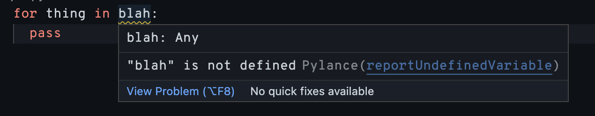
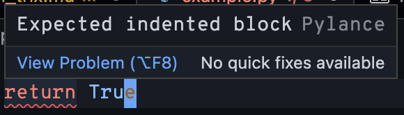

# Editing Python

This section contains general tips to improve your experience writing Python.

## Listen to your IDE

Many popular IDEs, such as [PyCharm] and [VSCode], will tell you if your code
has issues in it that may create bugs down the line. Look out for red or yellow
squiggles under your code, and hover over these spots to find issues in your
code. Learning to pay attention to these squiggles can save you hours of
debugging trying to find out why something isn't working.





### Setting up [Pylint] and [Black] in your IDE

6.101 in Spring 2023 introduces [Pylint] and [Black]. [Pylint] can help you spot
errors and bad code style in your code, while [Black] formats your code into a
common style that's more readable.[^tools] The "Command Line" reading can help
you install these tools on your computer.

#### VSCode

In VSCode, Pylint and Black can both be used with the official [Python
extension].

Once you've installed this extension, you can switch the linter to Pylint by
[following these instructions](https://code.visualstudio.com/docs/python/linting#_enable-linting).
It should be turned on by default if you have Pylint installed.

You can set the code formatter to use Black with
[these instructions](https://code.visualstudio.com/docs/python/editing#_formatting).

The "Format on Save" option in settings will automatically run Black and fix
your code for you every time you save it.

#### PyCharm

Setting up Pylint in PyCharm can be done with
[this Pylint extension](https://plugins.jetbrains.com/plugin/11084-pylint).

Similarly, there's also an extension to format your code with Black. Follow
[the instructions here](https://black.readthedocs.io/en/stable/integrations/editors.html#as-local-server)
to set it up.

[pylint]: https://pylint.readthedocs.io/en/stable/
[black]: https://black.readthedocs.io/en/stable/
[vscode]: https://code.visualstudio.com/
[pycharm]: https://www.jetbrains.com/pycharm/
[python extension]:
  https://marketplace.visualstudio.com/items?itemName=ms-python.python

[^tools]:
    While it might seem at first glance that Pylint and Black are similar tools,
    they actually do different things! Pylint is a
    **[linter](<https://en.wikipedia.org/wiki/Lint_(software)>)**, which helps
    you spot errors and bad patterns in your code, while Black is a
    **formatter**, which automatically restructures your code into a common
    format to make it easier to read and consistent with style.

### Turning off Black formatting

If you're using Black to format your code, you'll notice that sometimes it likes
to reformat your lists, when we might want them formatted a different way. Say
I'm using a length-9 list to represent a 3&times;3 data structure. I might
format this list like this to hint at this behavior.

```py
my_box = [
    0,  1,  2,
    3,  4,  5,
    6,  7,  8,
]
```

With Black, however, `my_box` gets turned into a long list, removing this nice
3&times;3 grid that we made.

```py
# After formatting with Black
my_box = [
    0,
    1,
    2,
    3,
    4,
    5,
    6,
    7,
    8,
]
```

We can use a comment of `#!py # fmt: off` to turn off formatting temporarily,
and `#!py # fmt: on` to turn it back on. Black will ignore all code between
these two comments, leaving our precious `my_box` alone.

```py
# fmt: off
my_box = [
    0,  1,  2,
    3,  4,  5,
    6,  7,  8,
]
# fmt: on
```

## Error messages are telling you something!

Similarly, error messages in Python are designed to tell you what your problem
is and where it occurs in your code. Reading these messages, finding the spot in
your code where the error is occurring, and sometimes even giving it a google
can help you a lot. Python 3.11 will even point at where the error is located in
a specific line of your code.

Say I create a function that takes in a list of names, and prints `Hello, name!`
for every person in the list, and save it in a Python file called hello.py.

```python linenums="1"
def say_hello(people):
    for person in people:
        print(f"Hello, {person}!")

say_hello(["Cameron", "Ben", "Alyssa"])
say_hello(123)
```

The file prints the first three names fine, but then we get an error that shows
up in the command line:

```
Hello, Cameron!
Hello, Ben!
Hello, Alyssa!
Traceback (most recent call last):
  File "/Users/cmk/Documents/class/6.101/python_trix/example.py", line 6, in <module>
    say_hello(123)
  File "/Users/cmk/Documents/class/6.101/python_trix/example.py", line 2, in say_hello
    for person in people:
TypeError: 'int' object is not iterable
```

What we see underneath the first three lines is called a [stack trace], which
tells us on which lines of the code the error ocurred. In the stack trace above,
we can see the entire problem. I passed in `123` instead of a list of strings,
and the `say_hello(people)` function is trying to iterate over the `people`
variable. However, `123` is an `int`, not a `list` that the code expects.

The last line in the stack trace tells us why the code stopped working, and it
confirms our suspicion: we can't iterate over an `int` object, which is a
[TypeError].

[stack trace]: https://en.wikipedia.org/wiki/Stack_trace
[typeerror]: https://docs.python.org/3/library/exceptions.html#TypeError

## Variable Names and Comments

You should always use variable names that describe what data the variable holds.
**Please don't use variables like `temp`, `var`, or `list`.** These don't
provide any context and make it harder for you, and LAs helping you, to
understand your own code.

Python also uses `snake_case` by convention for variables and functions, as
opposed to `camelCase` or `UpperCamelCase`. Use `UpperCamelCase` for your
classes. Following these conventions will make your code easier to read by other
Python developers and LAs in 6.101.

```python linenums="1"
# Don't do this, it's unclear how this code works.
temp = "cameron kleiman"

def helper(string):
    list = string.split()
    return " ".join(s.capitalize() for s in list)

result = helper(temp)
```

```python linenums="1"
# Do this instead! What each line does is clear from the variable and function names.
full_name = "cameron kleiman"

def capitalize_name(name):
    name_parts = name.split()
    return " ".join(n.capitalize() for n in name_parts)

capitalized_name = capitalize_name(full_name)
```

Use comments to explain complicated parts of your code, but don't just rewrite
what the a line of code is doing in a comment. Most of the time, you don't need
that many comments in your code. Instead, you can usually rename some variables
or refactor your code into appropriately-named helper functions. Then, someone
with a good knowledge of Python can read your code and understand what it does
without having to read any comments.

This concept is usually referred to as "self-documenting code", and
[this StackOverflow answer](https://stackoverflow.com/a/209089) has a great
example of how it's useful. **Try to make your code in 6.101 self-documenting!**

Below you can see an example of good comments versus bad comments. Consider this
method for booking a ticket which modifies a global list of flights and
increments a ticket counter. Some comments have been added that **do not** add
any helpful information to someone reading the code.

```python linenums="1"
flights = [
    {'origin': 'BOS', 'destination': 'JFK', 'seats': 150},
    {'origin': 'BOS', 'destination': 'ATL', 'seats': 200},
    {'origin': 'JFK', 'destination': 'LAX', 'seats': 250},
    {'origin': 'LAX', 'destination': 'SFO', 'seats': 100},
    {'origin': 'BOS', 'destination': 'LAX', 'seats': 250},
    {'origin': 'JFK', 'destination': 'DFW', 'seats': 150}
]

tickets = []


def book_ticket(origin, destination):
    for flight in flights:  # Iterate through all the flights
        # If the flight origin and destination match, decrement seats by 1
        if origin == flight['origin'] and destination == flight['destination']:
            flight['seats'] -= 1
            break
    else:
        return

    # Create a new dictionary for the ticket
    ticket = {'id': next_id(),
              'origin': origin, 'destination': destination}
    tickets.append(ticket)
    return ticket  # Return the ticket
```

These comments just restate directly what the code is doing, without addressing
_why_ the code works that way. Also, some less common elements such as the
`else` block of the for loop are left unexplained. Comments that address the
broader aspects of _why_ your code works the way it does will be much more
helpful to anyone reviewing your code. See the example below for some improved
commenting:

```python linenums="1"
def book_ticket(origin, destination):
    """
    Books a ticket and updates the flights and tickets
    global variables with the new ticket.
    """
    # Search for matching flight and update its number of seats
    for flight in flights:
        if origin == flight['origin'] and destination == flight['destination']:
            flight['seats'] -= 1
            break
    else:
        return  # if none of the flights match, return without doing anything

    # Issue a new ticket with the next id number
    ticket = {'id': next_id(),
              'origin': origin, 'destination': destination}
    tickets.append(ticket)
    return ticket
```

This example uses comments more effectively compared to the previous one by:

- adding a [docstring] that explains what the entire function does at a high
  level
- adding other high level comments inside the function that explain what
  specific chunks of the function do
- explaining what the more complicated pieces of the code do, such as the `else`
  block of the for loop

**In short, use comments to explain the higher level _why_ of your code without
just restating what the code does.**

[docstring]: https://www.programiz.com/python-programming/docstrings

## Using Underscore `_` as a variable name

Sometimes we don't want to use a variable in a list comprehension or a for loop.
A common convention in Python is to assign this to a single underscore `_`
variable name to indicate that that variable isn't used.

If we want to call a function 10 times, we could discard the iterator variable
like so:

```python
for _ in range(10):
    do_thing()
```

It's less common, but you can also do this in a list comprehension! Say we want
to make a list of 10 random numbers. We don't need the iterator, so we can
assign it to `_` to show that we're not using it.

```python
values = [random.random() for _ in range(10)]
```
